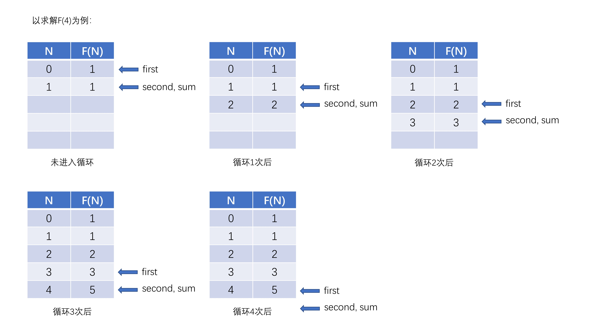
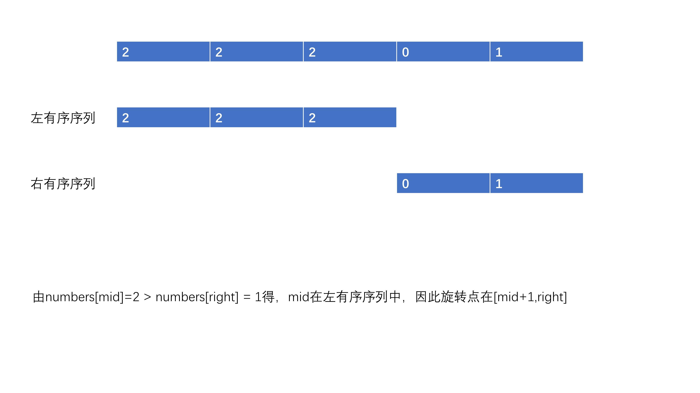
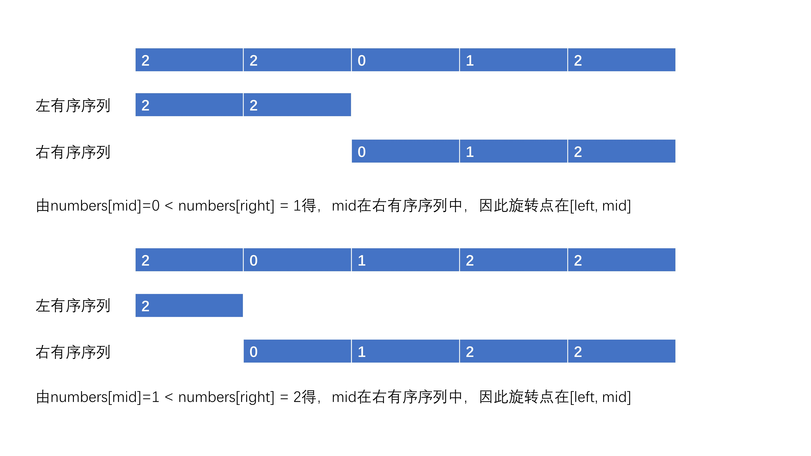

# 剑指 Offer 03. 数组中重复的数字

## 思路

看到“重复”两个字，很容易想起Java的哈希表（Set）的特性：无序、不可重复。

思路很简单，对数组进行遍历，如果Set中已经存储有该元素则直接返回。

### 算法流程

1. 创建一个哈希表set
2. 线性遍历数组nums中的每一个元素num
   1. num在set中，直接返回num
   2. num不在set中，需要将num加入到set
3. 因为题目保证有重复数字，所以在没有遍历完所有元素时候方法就会结束。为了保证语法正确，最后可以return -1即可。

## 代码实现

```java
class Solution{
  	public int findRepeatNumber(int[] nums){
      	Set<Integer> set = new HashSet<>();
      	for(int num : nums){
          	if(set.contains(num)){
              	return num;
            }
          	set.add(num);
        }
      	return -1;
    }
}
```

## 复杂度分析

时间复杂度：线性遍历每一个num的时间复杂度为O(N)，检查set中是否存在num即set中加入num的时间复杂度为O(1)，即时间复杂度为O(N*1)=O(N)

空间复杂度：set占用O(N)的额外空间，即空间复杂度为O(N)


# 剑指 Offer 04. 二维数组中的查找

## 方法1：模拟

### 思路

因为本题没有对时间复杂度有要求，可以采用暴力模拟，但是其没有使用题中所给数组的特性：每一行从左至右依次增加，每一列从上至下依次增加。所以暴力模拟自然不是最优解。

#### 算法流程

1. 边界判断，如果matrix为null，或者matrix的长度为0，直接返回false
2. 按行遍历二维数组matrix的每一个元素，如果和target相同则直接返回true
3. 若正常遍历结束则说明数组中无该元素，直接返回false

### 代码实现

```java
class Solution {
    public boolean findNumberIn2DArray(int[][] matrix, int target) {
        //边界判断一下
        if (matrix == null || matrix.length == 0) {
            return false;
        }
        for (int i = 0; i < matrix.length; i++){
            for (int j = 0; j < matrix[0].length; j++){
                if (matrix[i][j] == target){
                    return true;
                }
            }
        }
        return false;
    } 
}
```


### 复杂度分析

时间复杂度：对于m行n列的二维数组，事件复杂度为O(m*n)

空间复杂度：没有开辟辅助空间，故空间复杂度为O(1)


## 方法2：线性遍历+二分查找

### 思路

一个m✖️n的二维数组是由m个长度为n的一维数组构成的，由题目可知，每个一维数组是有序的，即可以在每个一维数组matrix[i]中用二分查找的方法查找target是否存在，调用m次二分查找即可查出target是否存在于二维数组中。


#### 算法流程

主方法：

1. 边界判断，如果matrix为null，或matrix.length==0，直接返回false
2. 定义变量m为matrix的长度
3. 对matrix[i]（0<= i <= m）进行遍历，调用二分查找find方法，查找目标元素target是否存在于matrix[i]中，若存在则返回true
4. 正常遍历结束则说明目标元素target不在数组中，返回false

二分查找方法：

1. 定义left为一维数组nums的左边界，right为一维数组nums的右边界，区间为左闭右闭，即在nums[left,...,right]中查找目标元素target
2. 当left<=right时
   1. 定义中间元素的下标mid=left + (right-left)/2
   2. 若nums[mid] == target，返回true
   3. 若nums[mid] > target，则在左区间进行查找，即right = mid - 1
   4. 若nums[mid] < target，则在右区间进行查找，即left = mid + 1
3. 循环正常退出说明目标元素target不在数组中，返回false


### 代码实现

```java
class Solution {
    //主方法
    public boolean findNumberIn2DArray(int[][] matrix, int target) {
        //边界判断一下
        if (matrix == null || matrix.length == 0) {
            return false;
        }
        int m = matrix.length;
        for (int i = 0; i < m; i++){
            if(find(matrix[i],target)){
                return true;
            }
        }
        return false;
    }
    //二分查找
    public boolean find(int[] nums, int target){
        int left = 0;
        int right = nums.length - 1;
        //左闭右闭
        while(left <= right){
            int mid = left + (right - left) / 2;
            if(nums[mid] == target){
                return true;
            }else if(nums[mid] > target){
                right = mid - 1;
            }else{
                left = mid + 1;
            }
        }
        return false;
    }
}
```


### 复杂度分析

时间复杂度：线性遍历m个一维数组，时间复杂度为O(m)，遍历每个一维数组时候调用二分查找方法的时间复杂度为O(logn)，即总的时间复杂度为O(mlogn)

空间复杂度：虽然二分查找循环内部每次都创建了int型变量mid，但是用完即回收，故其空间复杂度为常数级，即O(1)


## 方法3：类比二叉搜索树


# 剑指 Offer 05. 替换空格

## 思路

模拟：遍历目标字符串，遇到字符为' '直接替换即可


### 算法流程

1.创建一个StringBuilder的变量answer用于保存最终的返回值

2.线性遍历目标字符串s的每个字符c

​    1.若c是空格，则调用append方法加入"%20"

​    2.若c不是空格，则调用append方法加入c

3.返回answer.toString();


## 代码实现

```java
class Solution {
    public String replaceSpace(String s) {
        StringBuffer answer = new StringBuffer();
        for(int i = 0; i < s.length(); i++){
            if(s.charAt(i) == ' '){
                answer.append("%20");
            }else{
                answer.append(s.charAt(i));
            }
        }
        return answer.toString();
    }
}
```


## 复杂度分析

时间复杂度：O(n)，其中n为s.length(),StringBuilder的append方法为O(1)，故而时间复杂度为O(n*1)=O(n)

空间复杂度：开辟StringBuilder类型的变量answer的空间为O(n)

 

## 思考

为什么不用String直接进行拼接，而要用StringBulider进行拼接

因为String是不可变的字符串，所以进行拼接的时候不是在原字符串上进行操作，其实际操作流程为：

1. 先将原字符串new为StringBuilder，

2. 调用StringBuilder的append方法进行拼接

3. 返回toString()

以如下代码为例，说明String的拼接过程

 ```java
 public class Main {
     public static void main(String[] args) {
         String str1 = "John";
         String str2 = "Doe";
         System.out.println(str1 + str2);
     }
 
 }
 ```

1. 调用javac Main.java，将java类编译为字节码.class

2. 调用javap -c Main.class，反编译字节码查看其细节内容，如下所示

```java
Compiled from "Main.java"
public class Main {
  public Main();
    Code:
       0: aload_0
       1: invokespecial #1                  // Method java/lang/Object."<init>":()V
       4: return

  public static void main(java.lang.String[]);
    Code:
       0: ldc           #2                  // String John
       2: astore_1
       3: ldc           #3                  // String Doe
       5: astore_2
       6: getstatic     #4                  // Field java/lang/System.out:Ljava/io/PrintStream;
       9: new           #5                  // class java/lang/StringBuilder
      12: dup
      13: invokespecial #6                  // Method java/lang/StringBuilder."<init>":()V
      16: aload_1
      17: invokevirtual #7                  // Method java/lang/StringBuilder.append:(Ljava/lang/String;)Ljava/lang/StringBuilder;
      20: aload_2
      21: invokevirtual #7                  // Method java/lang/StringBuilder.append:(Ljava/lang/String;)Ljava/lang/StringBuilder;
      24: invokevirtual #8                  // Method java/lang/StringBuilder.toString:()Ljava/lang/String;
      27: invokevirtual #9                  // Method java/io/PrintStream.println:(Ljava/lang/String;)V
      30: return
}

```


3. 其中第9行new，代表new一个StringBuilder的变量

4. 其中第17行invokevirtual代表调用了StringBuilder的append方法加入John
5. 其中第21行invokevirtual代表调用了StringBuilder的append方法加入Doe

5. 翻译为StringBuilder的Java代码如下所示

 ```java
 public class Main {
     public static void main(String[] args) {
         String str1 = "John";
         String str2 = "Doe";
         System.out.println(new StringBuilder().append(str1).append(str2).toString());
     }
 }
 ```


综上，String的拼接过程其底层是由StringBuilder的append方法实现的，字符串频繁拼接的时候，需要不断的重复new、append、toString这一过程，显然开销要比StringBuilder的append进行字符串拼接的开销更大


# 剑指 Offer 06. 从尾到头打印链表

## 方法1：栈

### 思路

题目要求从后到前返回每个节点的值，而单链表只支持从头到尾进行遍历。利用栈后入先出的特性，可以很好的解决这一问题。

#### 算法流程

1. 边界考虑，若链表为空，直接返回长度为0的数组

2. 创建一个栈stack，用于保存链表中每个节点值

3. 线性遍历每个链表节点，将链表节点值加入到栈中

4. 创建一个大小为栈大小stack.size()的数组res

5. 若栈非空

   将栈中的值不断弹出存入数组res中

6. 返回数组res

### 代码实现

```java
class Solution {
    public int[] reversePrint(ListNode head) {
        if(head == null){
            return new int[0];
        }
        Deque<Integer> stack = new LinkedList<>();
        while(head!=null){
            stack.push(head.val);
            head = head.next;
        }
        int[] res = new int[stack.size()];
        int index = 0;
        while(!stack.isEmpty()){
            res[index++] = stack.pop();
        }
        return res;
    }
}
```


### 复杂度分析

时间复杂度：设链表的长度为n，线性遍历一次链表的时间复杂度为O(n)，遍历栈的时间复杂度为O(n)，故总的时间复杂度为O(n)+O(n)=O(n)

空间复杂度：开辟了一块大小为n的栈，故而空间复杂度为O(n)


## 方法2：递归

### 思路

可以利用递归先走到链表的最末端，在回溯的阶段访问当前节点值，即可实现链表的反向遍历

#### 算法流程

1. 创建一个ArrayList类型的类变量list用于存储反向遍历的链表节点值
2. 边界判断，如果链表为空，则直接返回长度为0的数组
3. 调用递归函数
   1. 递归阶段：若当前节点值为null则表明已经越过为节点，直接返回，否则继续向head.next移动
   2. 回溯阶段：层层回溯时，将当前节点值加入列表list
4. 递归回溯完成以后，将list转换为数组返回即可

### 代码实现

```java
class Solution {
    List<Integer> list = new ArrayList<>();

    public int[] reversePrint(ListNode head) {
        if (head == null) {
            return new int[0];
        }
        recur(head);
        int[] res = new int[list.size()];
        for (int i = 0; i < list.size(); i++) {
            res[i] = list.get(i);
        }
        return res;
    }

    public void recur(ListNode node) {
        //递归出口
        if (node == null) return;
        //递归阶段
        recur(node.next);
        //回溯阶段
        list.add(node.val);
    }
}
```


### 复杂度分析

时间复杂度：设链表的长度为n，将列表转换为数组的时间复杂度为O(n)，递归遍历链表的时间复杂度为O(n)，总的时间复杂度为O(n)+O(n)=O(n)

空间复杂度：递归栈需要开辟一块长度为n的空间，其空间复杂度为O(n)，列表list的空间复杂度也为O(n)，总的空间复杂度为O(n)+O(n)=O(n)


# 剑指 Offer 07. 重建二叉树

## 思路

前序遍历的结果为【根节点｜左子树前序遍历序列｜右子树前序遍历序列】

中序遍历的结果为【左子树中序遍历序列｜根节点｜右子树中序遍历序列】

利用左子树的前序遍历序列和左子树的中序遍历序列可以重建左子树，即重建二叉树是可以划分出子问题的，可以采用分治的算法，即

1. 创建根节点
2. 重建二叉树的左子树
3. 重建二叉树的右子树

设前序遍历序列的下标范围为[pBegin,pEnd]，中序遍历序列的下标范围为[iBegin,iEnd]

所以问题转化为以下几个问题

1. 如何创建根节点

   前序遍历的第一个节点即为二叉树的根节点

2. 定位左子树的前序遍历序列

   左子树的前序序列的左边界容易确定，即pBegin+1

   左子树的前序序列的右边界需要知道左子树的长度lLength，即pBegin+lLength，lLength可以通过根节点在中序遍历中的位置position求出

3. 确定根节点在中序遍历序列中的位置position和左子树的长度

   建立一个哈希表，存储节点值到中序遍历序列下标的映射。如中序遍历结果[9,3,15,20,7]，节点9的下标为0，节点3的下标为1。我们确定了根节点，即可查哈希表查出该节点在中序遍历中的下标，左子树的长度lLength=position-iBegin

4. 定位左子树的中序遍历序列

   左子树的中序序列的左边界为iBegin

   左子树的中序序列的右边界为position-1

5. 定位右子树的前序遍历序列

   右子树的前序序列的左边界为左子树前序序列的右边界+1，即pBegin+lLength+1

   右子树的前序序列的右边界为pEnd

6. 定位右子树的中序遍历序列

   右子树的中序序列的左边界为position+1

   右子树的中序序列的右边界为iEnd

### 算法流程

主方法：

1. 边界考虑，如果传入的数组为空，或者数组长度为0，直接返回null
2. 创建一个哈希表pos的类变量用于存储节点值到中序序列下标的映射关系
3. 调用helper方法完成二叉树的重建

helper方法定义：利用分治法，传入二叉树的前序序列、中序序列构造二叉树，前序序列左右边界、中序序列左右边界等参数，返回值为根节点

1. 出口，如果前序序列的左边界pBegin大于pEnd，说明越过了叶子结点，直接返回null即可
2. 通过计算根节点在中序遍历序列的位置position
3. 利用preorder[pBegin]创建根节点
4. 计算左子树的长度ILength=position-iBegin
5. 调用helper生成左子树
6. 调用helper生成右子树
7. 返回根节点

## 代码实现

```java
class Solution {
    Map<Integer, Integer> pos = new HashMap<>();

    public TreeNode buildTree(int[] preorder, int[] inorder) {
        for (int i = 0; i < inorder.length; i++) {
            pos.put(inorder[i], i);
        }
        TreeNode root = helper(preorder,0,preorder.length-1,inorder,0,inorder.length-1);
        return root;
    }

    //构造树的辅助函数
    public TreeNode helper(int[] preorder, int pBegin, int pEnd, int[] inorder, int iBegin, int iEnd) {
        //出口
        if (pBegin > pEnd) {
            return null;
        }
        int position = pos.get(preorder[pBegin]);
        TreeNode root = new TreeNode(preorder[pBegin]);
        int lLength = position-iBegin;
        root.left = helper(preorder, pBegin + 1, pBegin +lLength, inorder, iBegin, position - 1);
        root.right = helper(preorder, pBegin + lLength+1, pEnd, inorder, position + 1, iEnd);
        return root;
    }
}
```


## 复杂度分析

设二叉树的节点数位n

时间复杂度：主方法中线性遍历二叉树的中序遍历序列的时间复杂度为O(n)，helper方法中需要创建n个节点搜索n个节点，其时间复杂度也为O(n)，故而总的时间复杂度为O(n)+O(n)=O(n)

空间复杂度：HashMap的空间复杂度为O(n)，递归深度平均情况下为O(logn)，最差情况下，当输入的二叉树为单链表时，递归深度为O(n)，故而总的空间复杂度为O(n)+O(logn)=O(n)


# 剑指 Offer 09. 用两个栈实现队列

## 思路

队列是先入先出的数据结构，栈是后入先出的数据结构，故而一个栈无法实现队列的功能，因为出栈和出队的顺序永远相反。

两个栈负负得正，可以实现倒排的功能，从而实现队列的功能。如栈A：[1,2,3,4]的出栈顺序为4321，借助栈B[]，将所有栈A的元素先出栈后入栈B，可得栈B：[4,3,2,1]，此时栈B的出栈顺序即为1234，与队列的出队顺序相同

当只有一个栈的时候，队首元素对应着栈底元素，出队意味着栈底元素需要出栈，即所有非栈底元素都要出栈，但是非栈底元素不能删除而要保存。如栈A[1,2,3,4]模拟出队，需要先将4，3，2，1依次弹出，但是4，3，2要保存起来，这就是栈B的作用：保存栈A中非栈底元素，倒排实现出队顺序。此时栈B为[4,3,2,1]，1出队后栈B变为[4,3,2]，再需要出队时从栈B弹栈即可，此时顺序与队列出队顺序一致

综上，栈A用于入队，栈B用于出队

### 算法流程

1. 创建两个类变量stackA和stackB分别用于入队和出队

2. 构造方法实现

   初始化两个栈即可

3. 入队appendTail实现

   直接将元素加入栈A

4. 出队deleteHead实现

   1. 如果队列为空直接返回-1，栈A栈B同时为空表明队列为空
   2. 如果用于出队的栈B为空，则需要将栈A中所有元素弹栈后加入栈B
   3. 栈B不为空，直接弹栈


## 代码实现

```java
class CQueue {
    Deque<Integer> stackA;
    Deque<Integer> stackB;
    public CQueue() {
        stackA = new LinkedList<>();
        stackB = new LinkedList<>();
    }
    
    public void appendTail(int value) {
        stackA.push(value);
    }
    
    public int deleteHead() {
        if (stackA.isEmpty() && stackB.isEmpty()){
            return -1;
        }

        if (stackB.isEmpty()) {
            while (!stackA.isEmpty()) {
                stackB.push(stackA.pop());
            }
        }
        return stackB.pop();
    }
}
```


## 复杂度分析

时间复杂度：appendTail()时间复杂度为O(1)；deleteHead()时间复杂度为O(1-n)，当栈B不为空的时候为O(1)，最坏情况下n个元素都在栈A中，需要将n个元素全部弹栈至栈B，时间复杂度为O(n)

空间复杂度：最坏情况下，两个栈同时保存n个元素，空间复杂度为O(n)


# 剑指 Offer 10- I. 斐波那契数列

## 方法1：递归

### 思路

F(0) = 0, F(1) = 1， F(N) = F(N - 1) + F(N - 2)，其中N>1

即F(N+1)可以转换为求F(N)和F(N - 1)两个子问题，因此可以使用递归，递归出口为F(0) = 0, F(1) = 1

递归求解斐波那契数列有很严重的缺点-重复计算，如求解F(5)的时候，要先求解F(3)和F(4)（求F(4)的时候要先求解F(3)和F(2)），即F(3)被重复求了两次。当F(N)中的N越大，重复计算次数会越多。最理想的状态应该是我们只求解1次拿来直接用。

#### 算法流程

1. 如果n小于等于1，直接返回n
2. 否则返回fib(n-1)+fib(n-2)

### 代码实现

```java
class Solution {
    public int fib(int n){
        return n <= 1 ? n : fib(n-1)+fib(n-2);
    }
}
```

但是很遗憾，代码超时了

### 复杂度分析

时间复杂度：如图所示，求解F(N)时，从F(0)~F(N)构成了一个接近N层的完全二叉树，故时间复杂度为O(2^n^)

空间复杂度：如图所示，求解F(N)时，从F(0)~F(N)构成了一个接近N层的完全二叉树，即递归栈的深度为O(2^n^)，故而空间复杂度为O(2^n^)


## 方法2：动态规划

### 思路

因为F(N) = F(N - 1) + F(N - 2)，其中N>1，显然F(N)可以由F(N - 1)和F(N - 2)推导而来，即一个状态由其前两个状态有关，故而可以采用动态规划进行求解。

动态规划主要注意如下几个方面：

1. 状态的定义：本题状态定义为，F(N)表示斐波那契数列第N项的取值
2. 状态的初始化：本题初始状态为F(0) = 0, F(1) = 1
3. 状态的转移方程：本题的状态转移方程已经由斐波那契数列的公式给出，即F(N) = F(N - 1) + F(N - 2)

#### 算法流程

1. 边界判断，当n<=1时，返回n
2. 创建常量MOD
3. 创建长度为n+1的数组dp[0,,,,,,n]，其中dp[i]表示斐波那契数列的第i项，即F(i)
4. 初始化dp[0]=F(0)=0，dp[1]=F(1)=1
5. 线性遍历dp，生成dp[2],......,dp[n]，注意对MOD取模
6. 返回dp[n]

### 代码实现

```java
class Solution {
    public int fib(int n) {
        final int MOD = 1000000007;
        if (n <= 1) {
            return n;
        }
        int[] dp = new int[n + 1];
        dp[0] = 0;
        dp[1] = 1;
        for (int i = 2; i < n + 1; i++) {
            dp[i] = (dp[i - 1] + dp[i - 2]) % MOD;
        }
        return dp[n];
    }
}
```

### 复杂度分析

时间复杂度：线性遍历的复杂度为O(n)

空间复杂度：dp[]需要开辟了一块长度为n+1的线性空间，因此空间复杂度为O(n+1)=O(n)

## 方法3：动态规划-空间压缩

### 思路

利用动态规划求解该题时，F(N)只与F(N-1)与F(N-2)有关，因此我们只需要用两个变量first，second来存储F(N-1)与F(N-2)，再创建一个变量sum用于在迭代的过程中使first，second交替向前。举个例子，求解F(5)，当循环体**将要**求解F(3)时first存F(1)，second存F(2)，求完F(3)之后，将要求F(4)时，first，second交替向前变为first存F(2)，second存F(3)。具体见代码实现。

#### 算法流程

1. 创建常量MOD
2. 创建变量first，初始化为F(0)，且first另一个含义为F(N)，初始的时候N=0
3. 创建变量second，初始化为F(1)
4. 创建变量sum，用于暂存first+second的结果并辅助first与second交替向前
5. 执行for循环
   1. 求解sum=(first+second)%MOD
   2. 将second赋值给first，将sum赋值给second，以实现first与second的交替向前
6. 循环执行0次，first=F(0)，循环执行1次，first=F(1)，循环执行N次，first=F(N)，即返回first即可

### 代码实现

```java
class Solution {
    public int fib(int n) {
        final int MOD = 1000000007;
        int first = 0;
        int second = 1;
        int answer = 1;
        for (int i = 0; i < n; i++) {
            answer = (first + second) % MOD;
            first = second;
            second = answer;
        }
        return first;
    }
}
```


### 复杂度分析

时间复杂度：线性循环的时间复杂度为O(3*n)=O(n)，因此时间复杂度为O(n)

空间复杂度：只有三个变量first，second，sum，即空间复杂度为O(1)


# 剑指 Offer 10- II. 青蛙跳台阶问题

## 思路

题目中说一个青蛙可以跳上1级台阶，也可以跳上2级台阶，第i级台阶可以由青蛙从第i-1级台阶跳1级跳到，也可以由青蛙从第i-2级台阶跳2级跳到。设F(N)为青蛙跳到第N级台阶的跳法，则显然F(N)可以由F(N-1)与F(N-2)推出，因此此题可以用动态规划求解。

分别讨论动态规划的几个问题

1. 状态的定义

   定义F(N)为青蛙跳到第N级台阶的跳法

2. 状态的转移方程

   1. 当从第N-1跳1级台阶时，F(N) = F(N-1)
   2. 当从第N-2跳2级台阶时，F(N) = F(N-2)
   3. 综上，两者取和，可得到状态转移方程F(N) = F(N-1) + F(N-2),(N>1)

3. 状态初始化

   1. F(1) = 1，直接跳到1级台阶，所以F(1) = 1
   2. F(0) = 1，因为青蛙跳到第2级台阶有两种方式，所以F(0)=F(2)-F(1) = 1，这个初始化需要注意

从上面的状态转移方程我们可以看出，此题是斐波那契数列的实际应用题，仅在F(0)初始化时有所不同。

### 算法流程

1. 创建常量MOD
2. 创建变量first，初始化为F(0)，且first另一个含义为F(N)，初始的时候N=0
3. 创建变量second，初始化为F(1)
4. 创建变量sum，用于暂存first+second的结果并辅助first与second交替向前
5. 执行for循环
   1. 求解sum=(first+second)%MOD
   2. 将second赋值给first，将sum赋值给second，以实现first与second的交替向前
6. 循环执行0次，first=F(0)，循环执行1次，first=F(1)，循环执行N次，first=F(N)，即返回first即可

## 代码实现

```java
class Solution {
    public int numWays(int n) {
        final int MOD = 1000000007;
        int first = 1;	//与斐波那契数列有所不同
        int second = 1;
        int sum = 1;
        for (int i = 0; i < n; i++) {
            sum = (first + second) % MOD;
            first = second;
            second = sum;
        }
        return first;
    }
}
```



## 复杂度分析

时间复杂度：线性循环的时间复杂度为O(3*n)=O(n)，因此时间复杂度为O(n)

空间复杂度：只有三个变量first，second，sum，即空间复杂度为O(1)


# 剑指 Offer 11. 旋转数组的最小数字

## 思路

当我们看到有序数组的相关问题时，一定要首先想到**二分法**。本体中的旋转数组虽然不是全部有序，但事实上，只要可以进行减治的都可以用**二分法**进行求解。

由题目可知，旋转数组由两部分局部有序的元素组成，且包含重复元素的旋转数组有一个非常重要的性质，即**左有序序列的任意一个元素值>=右有序序列的任意一个元素值**。另，我们把右有序序列的首元素成为**旋转点**，旋转点即为本题所求。

举个例子，原数组为[1,2,2,3,4,5,5]，将[1,2]放置在数组末尾得到旋转数组[2,3,4,5,5,1,2]，显然该旋转数组左有序序列[2,3,4,5,5]的任意一个元素值>=右有序序列[1,2]的任意的一个元素值，1为旋转点

二分法关键的问题在于确定搜索区间，搜索区间有两种形式，一种搜索区间为**左闭右闭**的区间，一种搜索区间为**左闭右开**的区间。关于这两种区间，如果有同学不明白，可以具体看[代码随想录 (programmercarl.com)](https://programmercarl.com/0704.二分查找.html)，本题解的搜索区间采用左闭右闭的区间。

二分法最特殊的三个位置分别时left，mid，right，通过numbers[mid]与numbers[left]、numbers[right]的比较确定旋转点所在的区间。

1. numbers[left]与numbers[mid]比较可行否？

   [2,3,4,5,1]与[1,2,3,4,5]，numbers[mid]>numbers[left]，但是旋转点1一个出现在mid左侧，一个出现在mid右侧。因此无法做到减治。

因此需要numbers[right]与numbers[mid]比较进一步减治，如下所示





### 算法流程

1. 声明变量left并初始化为0
2. 生命变量right并初始化为numbers.length-1
3. 循环二分（left<=right)
   1. 计算mid
   2. 若numbers[mid] == numbers[right]，无法判断mid处于左有序序列或有有序序列中
   3. 若numbers[mid] < numbers[right]，根据旋转数组性质说明mid处于右有序序列中，则旋转点的下标在[left, mid]，令right = mid
   4. 若numbers[mid] > numbers[right]，根据旋转数组性质说明mid处于左有序序列中，则旋转点的下表在[mid+1, right]，令left = mid + 1
4. 当right < left时退出循环，返回numbers[left]

## 代码实现

```java
class Solution {
    public int minArray(int[] numbers) {
        int left = 0;
        int right = numbers.length - 1;
        while(left <= right){
            int mid = left + ((right - left) >> 1);
            if (numbers[mid] == numbers[right]){
                right--;
            }else if (numbers[mid] < numbers[right]){
                right = mid;
            }else {
                left = mid + 1;
            }
        }
        return numbers[left];
    }
}
```

## 复杂度分析

时间复杂度：理想情况下为O(logn)，但是当传入的数组为常数数组时([2,2,2,2])时间复杂度为O(n)

空间复杂度：三个整型变量left, right, mid只使用常数大小的额外空间


# 剑指 Offer 12. 矩阵中的路径


# 剑指 Offer 14-I. 剪绳子


# 剑指 Offer 14-II. 剪绳子 II


# 剑指 Offer 15. 二进制中1的个数

## 思路

用一个计数器从低位到高位依次遍历1的个数即可。关键问题在于如何判断该位是1还是0，这个问题可以用与原算解决，如下所示为与运算的四种情况。

| a    | b    | a&b  |
| ---- | ---- | ---- |
| 1    | 1    | 1    |
| 1    | 0    | 0    |
| 0    | 1    | 0    |
| 0    | 0    | 0    |

从表可知，1&1=1，0&任意数=0，我们可以利用这个特性，让每一位的数字a&1，如果结果是1，则a=1，否则a=0。

以10111为例（从右往左分别是第0位，第1位......），判断第2位是否为1，只需10111&10，判断第4位是否为1，只需10111&1000，依此类推，如下表所示

| n     | 1<<i（i表示第i位） | n & (1 << i) |
| ----- | ------------------ | ------------ |
| 10111 | 1                  | 1            |
| 10111 | 10                 | 1            |
| 10111 | 100                | 1            |
| 10111 | 1000               | 0            |
| 10111 | 10000              | 1            |
|       | 一的个数           | 4            |


### 算法流程

1. 创建计数器cnt，初始化为0
2. for循环检查第i位是否为1
   1. 如果为1，cnt自增1
   2. 否则进入下一次循环
3. 返回cnt即可

## 代码实现

```java
public class Solution {
    // you need to treat n as an unsigned value
    public int hammingWeight(int n) {
        int cnt = 0;
        for (int i = 0; i < 32; i++) {
            if ((n & (1 << i)) != 0) {
                cnt++;
            }
        }
        return cnt;
    }
}
```


## 复杂度分析

时间复杂度：线性循环，时间复杂度为O(n)

空间复杂度：变量cnt只使用常数大小的额外空间，因此空间复杂度为O(1)